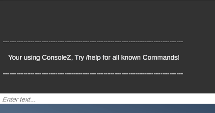
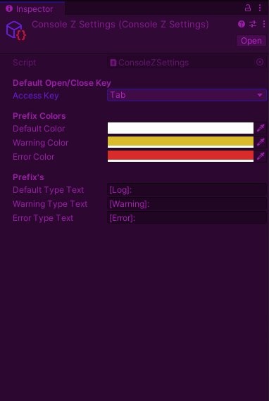

# ConsoleZ

This Repo holds the source code and UnityPackage asset for ConsoleZ. A simple and easy to use console that you link up to event within your unity game. 

## Features

* Ability to customise prefix colors
* Ability to customise prefix text
* Ability to customise access key to open/close the console
* Ability to store through default commands
* Easy access to add custom command or even link up with unity events

## GIFS!!!
Type directly to the console

Customise Prefix Colors, Text & Access key

